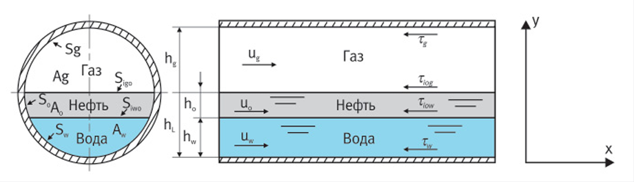
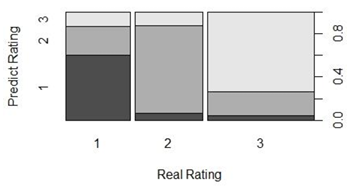

# *заголовки разных уровней:*

# Управление температурным режимом промысловой трубопроводной системы в условиях прогрессирующего роста обводненности скважинной продукции

## Аннотация

Тенденция роста обводненности и температуры добываемых флюидов ...

### Материалы	и	методы

Прогнозирование структуры течения жидкость-газ; прогнозирование ...

## *маркированные списки:*

В используемой базе данных информация об инвестиционных проектах компании задана с помощью значений следующих параметров, которые подробно описаны в статье [14]:

- стоимость проекта (Financing)
- экологичность проекта (Ecology)
- инновационность проекта (Innovativeness)
- технологичность проекта (Manufacturability)
- безопасность проекта (Norms)
- рейтинг проекта (Rating)

## *нумерованные списки:*

1. *Samuel A.L.* Some Studies in Machine Learning Using the Game of Checkers. IBM Journal of Research and Development. 1959. P. 206–226.
2. *Sandhya N. dhage, Charanjeet Kaur Raina.* A review on Machine Learning Techniques. In International Journal on Recent and Innovation Trends in Computing and Communication, Volume 4 Issue 3. 2016.
3. *Alloghani, Mohamed & Al-Jumeily, Dhiya & Mustafina, Jamila & Hussain, Abir & Aljaaf, Ahmed.* A Systematic Review on Supervised and Unsupervised Machine Learning Algorithms for Data Science. 2020. P. 3–23.
4. Alpaydın, E. Introduction to machine learning. Cambridge, MA: MIT Press. 2014.

## *URL-ссылки:* [Filler -- моя вторая игра на python](https://github.com/Deltams/Filler)

## *математические формулы в формате LaTeX:*

... гамма-распределения, предложенного	Whitson	[[10](#eq_10_f)]:

$$ P(M) = \frac{(M - \eta)^{\alpha - 1} \exp\left(-\frac{M - \eta}{\beta}\right)}{\beta^{\alpha} \Gamma(\alpha)} \tag{9} $$

где *M* — молекулярная масса компонентов нефти;
$\beta = \frac{M_{n+} - \eta}{\alpha}$ — параметр распределения;
$\alpha$ — параметр кривизны распределения;
$\eta = 14N - 6$; $\Gamma(\alpha)$ — гамма-функция.
Искомая	мольная	доля	псевдокомпонента нефти $z_i$
для	заданной	молярной	массы в	границах $[Mi-1, Mi]$ определяется	интегралом
$P(M)$ от $M_{i-1}$ до $M_i$:

<div id="eq_10_f">
$$ z_i = z_{C7+} \int_{M_{i-1}}^{M_i} P(M) \, dM = z_{C7+} \left[ P(M \leq M_i) - P(M \leq M_{i-1}) \right] \tag{10} $$
</div>


## *изображения:*



## *цитаты:*

Автор предлагает следующий алгоритм для построения финансовой модели:

> Для построения модели на основе алгоритма случайного леса необходимо разделить набор данных на
> тренировочный и тестовый, в работе данные были разделены в соотношении 60:40. 
> Далее была построена модель на основе всего набора данных на тренировочных данных,
> проведено прогнозирование на тестовых данных и выведен рис. 12 прогнозов:
```{r fig-model-rating, fig.align="center", fig.cap="Рис. 12. Результаты прогнозирования алгоритма", out.width="50%", echo=FALSE}

```

## *таблицы:*

| Номер куста | Тем‑ра на входе, $^\circ C$ | Давление на входе, атм | Расход нефти, $м^3$/сут | Расход воды, $м^3$/сут | Расход газа, кг/сут | Обводненность | Газовый фактор | Диаметр трубы, $м$ | Длина трубы, $м$ |
| --- | --- | --- | --- | --- | --- | --- | --- | --- | --- |
| K73 | 75 | 31 | 77,8 | 539,2 | 3 584,9 | 0,87 | 44,43 | 0,203 | 1 300 |
| K707 | 65 | 31 | 56,9 | 194,1 | 2 621,8 | 0,77 | 44,43 | 0,094 | 800 |
| K707a | 75 | 30 | 60,4 | 227,6 | 2 782,3 | 0,79 | 44,43 | 0,139 | 540 |
| K72 | 73 | 28 | 34,8 | 271,2 | 1 605,2 | 0,89 | 44,43 | 0,139 | 1 200 |
